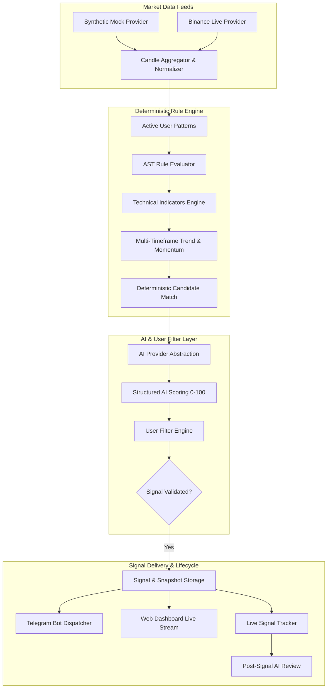

# TradePulse AI - AI-Powered Personalized Market Research & Telegram Signal Platform


[](https://www.python.org/downloads/)
[](https://fastapi.tiangolo.com)
[](https://react.dev)
[](https://www.typescriptlang.org/)
[](https://opensource.org/licenses/MIT)

TradePulse AI is a personalized **AI-Powered Quantitative Market Research, Pattern Detection, and Signal Notification Workstation** with an interactive Telegram Bot interface.

> [!IMPORTANT]
> **ABSOLUTE SCOPE RESTRICTION**: This system is strictly for **Market Research, Pattern Detection, Technical Analysis, and Notifications**. It **NEVER** places trades, executes broker orders, manages accounts, or automates browser actions.

---

## Key Features

- **Personal Pattern Library**: Build, version, and manage independent custom trading strategies.
- **Visual Reference Image Upload**: Attach reference images (PNG/JPG/WebP) as visual guides for every strategy.
- **Deterministic Rule Engine**: 100% deterministic code evaluation of candlestick sequences, body/wick ratios, support/resistance breakouts, and indicator crosses (`AND`, `OR`, `NOT` ASTs).
- **Pattern Type 14 Specification**: Built-in, fully testable implementation of Pattern Type 14 (Bearish start -> 2 Bullish base candles -> Support level created -> Bearish breakdown close -> DOWN Signal).
- **Technical Analysis Engine**: Pure Python calculations for RSI, MACD, EMA (9/21), SMA (50/200), VWAP, Bollinger Bands, ATR, ADX, Stochastic, and S/R pivots.
- **Pluggable AI Quantitative Layer**: Heuristic/mock and LLM-based (OpenAI/Anthropic/Gemini) structured scoring, risk evaluation, and post-trade review.
- **Event-Driven Backtester**: Chronological, lookahead-bias-free historical simulation with equity curves, win-rate metrics, and trade logs.
- **Interactive Telegram Bot**:
  - Secure `/link <code>` account pairing from the web dashboard.
  - Concise main signal alert cards.
  - Interactive inline callback keyboards: 🧠 *AI Analysis*, 📊 *Technicals*, 📈 *Live Signal*, 📋 *Full Details*, 🔔 *Follow*, 🔕 *Mute*.
- **High-End Web Dashboard**: Cyber/dark trading UI built with React, Tailwind CSS, and TradingView Lightweight Charts.
- **Zero-Cost Out-of-the-Box Execution**: Runs locally without mandatory paid API keys using built-in synthetic market generators, mock AI quantitative analysis, and SQLite async fallback.

---

## System Architecture



---

## Quickstart Guide (Local Development)

### 1. Prerequisites
- Python 3.12+
- Node.js 18+ and npm

### 2. Backend Setup
```bash
cd backend
python -m venv venv

# Windows:
venv\Scripts\activate
# Linux/macOS:
source venv/bin/activate

pip install -r requirements.txt
uvicorn app.main:app --reload --port 8000
```
- API Documentation (Swagger): `http://localhost:8000/docs`
- Default Demo Account seeded automatically: `demo@tradepulse.ai` / `password123`

### 3. Frontend Setup
```bash
cd frontend
npm install
npm run dev
```
- Open `http://localhost:3000` in your browser.

---

## Running the Automated Test Suite

Run the full pytest suite (unit tests for indicators, rules AST, Pattern Type 14 fixtures, failures, and API integration):

```bash
backend\venv\Scripts\pytest -v
```

---

## Docker Compose Deployment

Run the complete containerized stack (PostgreSQL, Redis, FastAPI Backend, React Frontend):

```bash
docker compose up --build
```
- Web Application: `http://localhost:3000`
- REST API Documentation: `http://localhost:8000/docs`

---

## Documentation Index

- [Architecture & Flow](docs/architecture.md)
- [Deterministic Strategy Engine](docs/strategy-engine.md)
- [Pattern Strategy Builder](docs/pattern-builder.md)
- [Backtesting & Simulation](docs/backtesting.md)
- [Telegram Bot & Interactive Controls](docs/telegram.md)
- [AI Layer & Scoring](docs/ai.md)
- [Database Schema](docs/database.md)
- [REST API Reference](docs/api.md)
- [Security & Scope Guardrails](docs/security.md)
- [Data & AI Provider Abstraction](docs/providers.md)
- [Deployment Guide](docs/deployment.md)

---

## License
MIT License. Free for research and educational purposes.
