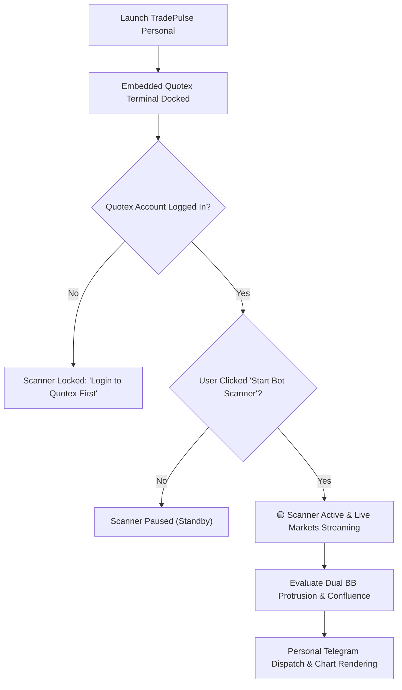

# TradePulse Personal Edition — Institutional Live Forex Workstation

> **Dedicated Personal Edition** engineered exclusively for authentic **Real Market Forex Currencies (Zero OTC)** with embedded Quotex terminal docking, hardware-locked licensing, 1-to-1 personal Telegram signal broadcasting, and algorithmic mean-reversion & trend confluence strategies.

📖 **Detailed User & Trading Guide**: See [docs/PERSONAL_USER_GUIDE.md](file:///c:/Users/shanj/OneDrive/Desktop/Ai-telegrambot/docs/PERSONAL_USER_GUIDE.md) for full step-by-step setup, Telegram BotFather configuration, Quotex docking walkthrough, and strategy mechanics.

---

## ⚡ Key Highlights & Specifications

| Feature | Specification |
| :--- | :--- |
| **Market Scope** | **100% Real Market Currencies Only** (EUR/USD, GBP/USD, USD/JPY, AUD/USD, USD/CAD, EUR/GBP, etc.) |
| **OTC Synthetic Pairs** | **Disabled (0% OTC)** — Eliminates synthetic broker price simulations |
| **Active Strategy** | **Dual Bollinger Band Protrusion Reversal (`DUAL_BOLLINGER_PROTRUSION_1M`)** |
| **Terminal Integration** | **Embedded Native Quotex Terminal** docked directly inside the desktop window |
| **Security & Activation** | **Single-PC HWID Hardware-Lock** + 1-Year Subscription License client |
| **Signal Broadcasting** | **Personal Telegram Channel/Direct Chat** with strict 5-user security quota |
| **Execution Architecture** | Intra-candle sub-second mathematical calculation with sequential trade locking |
| **Storage Isolation** | Isolated dedicated database (`tradepulse_personal.db`) & configuration (`strategies_personal.json`) |

---

## 🏛️ Gated Scanner Operation Protocol

TradePulse Personal enforces strict security and execution safety before dispatching live signals:



1. **Broker Login Gating**: The signal scanner remains **locked** until the user completes Quotex login in the embedded terminal.
2. **Explicit Activation**: Signals only dispatch when the user toggles the **Master Scanner** to **Active** (`🟢 ACTIVE & SCANNING`).
3. **Dedicated Personal Relay**: Dispatches real-time alerts directly to the user's configured Telegram channel or chat.

---

## 🎯 Active Core Strategy: Dual Bollinger Protrusion Reversal

The preloaded algorithmic engine is tuned specifically for 1-minute live Forex price dynamics:

### Technical Parameters
- **Timeframe / Expiry**: `1M` Candlesticks / `1-Minute` Trade Expiry
- **Bollinger Band 1 (BB1)**: Period = `10`, StdDev = `2.0`
- **Bollinger Band 2 (BB2)**: Period = `13`, StdDev = `2.0`
- **Dynamic Envelope Trigger**:
  $$\text{Upper Trigger} = \max(\text{Upper BB}_{10,2},\; \text{Upper BB}_{13,2})$$
  $$\text{Lower Trigger} = \min(\text{Lower BB}_{10,2},\; \text{Lower BB}_{13,2})$$

### Entry Criteria

#### 🟢 CALL (Buy Signal)
1. **Candle Color**: Forming/completed candle must be **bearish** ($\text{Close} < \text{Open}$).
2. **Dual-Band Penetration**: Price breaks below the lower boundary ($\text{Close} < \text{Lower Trigger}$).
3. **Body Protrusion Rule**: 
   $$(\text{Lower Trigger} - \text{Close}) \ge 20\% \text{ to } 25\% \times \text{Candle Body Size}$$
   *(Wicks alone crossing the lower band are automatically rejected).*
4. **Market Structure Filter**:
   - **Consolidation / Box Range** ($\text{ADX} < 25$): Valid immediately upon body breakout.
   - **Curving / Trending Wave** ($\text{ADX} \ge 25$): The candle low must simultaneously intersect a confirmed historical horizontal **Support level**.

#### 🔴 PUT (Sell Signal)
1. **Candle Color**: Forming/completed candle must be **bullish** ($\text{Close} > \text{Open}$).
2. **Dual-Band Penetration**: Price breaks above the upper boundary ($\text{Close} > \text{Upper Trigger}$).
3. **Body Protrusion Rule**: 
   $$(\text{Close} - \text{Upper Trigger}) \ge 20\% \text{ to } 25\% \times \text{Candle Body Size}$$
   *(Wicks alone crossing the upper band are automatically rejected).*
4. **Market Structure Filter**:
   - **Consolidation / Box Range** ($\text{ADX} < 25$): Valid immediately upon body breakout.
   - **Curving / Trending Wave** ($\text{ADX} \ge 25$): The candle high must simultaneously intersect a confirmed historical horizontal **Resistance level**.

---

## 🖥️ Workstation Navigation & Views

```
┌────────────────────────────────────────────────────────────────────────┐
│  ⚡ TradePulse Personal  [🔑 License: Active] [🏛️ Quotex: Live] [🟢 START]│
├──────────────┬─────────────────────────────────────────────────────────┤
│  📊 Markets  │  LIVE MARKETS MONITOR (27 Real Forex Pairs)            │
│  📈 Chart    │  Live Interbank Rates · Broker Payouts · Zero OTC       │
│  ⚙️ Strategy │─────────────────────────────────────────────────────────│
│  ✈️ Telegram │  LIVE CANDLESTICK STATION                               │
│  📜 History  │  Hardware-Accelerated Canvas · EMA 20/50 · Bollinger    │
│  🏛️ Broker   │─────────────────────────────────────────────────────────│
│  🛡️ Risk     │  EMBEDDED QUOTEX TERMINAL                               │
│              │  Native Browser Dock · Direct Account Login & Live PnL  │
└──────────────┴─────────────────────────────────────────────────────────┘
```

1. **📊 Live Markets Monitor**: Real-time ticker and broker payout board for all major, minor, and exotic interbank currency pairs.
2. **📈 Live Chart Station**: High-performance candlestick chart with Regular/Heikin-Ashi modes, EMA overlays, Bollinger Bands cloud, and multi-indicator technical analysis suite.
3. **⚙️ Strategy Workshop**: Custom strategy laboratory with 18 archetype presets, visual indicator builder, candle anatomy filters, and Smart Money Concepts (SMC).
4. **✈️ Personal Telegram Relay**: Connect your personal Telegram Bot Token and Chat/Channel ID to receive real-time pre-alerts, signals with rendered chart images, and trade outcome cards.
5. **📜 Trade History & PnL**: Comprehensive log of all dispatched signals, strike entry/exit prices, MFE/MAE excursions, and net session win rate.
6. **🏛️ Quotex Terminal**: Native docked Quotex web view allowing direct platform interaction without leaving the application.
7. **🛡️ Risk & Safeguards**: Automated circuit breakers, daily profit targets, maximum consecutive loss limits, news blackout calendar, and session schedulers.

---

## 🚀 Running TradePulse Personal

### 1. Standalone Executable (Windows)
Double-click `dist/TradePulsePersonal-Standalone.exe` or `dist/TradePulsePersonal/TradePulsePersonal.exe`.

### 2. Python Desktop GUI Mode
```bash
python main_personal.py
```

### 3. 24/7 VPS Background Headless Mode
```bash
python main_personal.py --headless
```

---

## 📁 File Structure & Storage Isolation

```
Ai-telegrambot/
├── main_personal.py               # Personal Edition application engine & WebView bridge
├── TradePulsePersonal.spec        # PyInstaller packaging configuration
├── ui_personal/                   # Personal GUI frontend assets (HTML, CSS, JS)
│   ├── index.html                 # Single-page personal workstation UI
│   ├── styles.css                 # Dark glassmorphic design system
│   ├── app.js                     # State controller & bridge communication
│   └── chart_widget.js            # Hardware-accelerated canvas chart renderer
├── core/                          # Modular backend subsystems
│   ├── indicators/engine.py       # Pure Python mathematical indicator suite
│   ├── strategy/rules_ast.py      # Abstract Syntax Tree pattern evaluation engine
│   ├── strategy/compiler.py       # Visual strategy to AST compiler
│   ├── strategy/manager.py        # Strategy profile manager (strategies_personal.json)
│   ├── licensing/client.py        # HWID cryptographic validator & heartbeat
│   ├── ingester/asset_registry.py # Real Forex asset catalog (OTC filtered out)
│   └── telegram/bridge.py         # Personal Telegram broadcast engine
└── ~/.tradepulse/                 # Local data directory
    ├── tradepulse_personal.db     # Dedicated SQLite database
    ├── strategies_personal.json   # Isolated personal strategy configuration
    └── tradepulse_personal.log    # Application rotating log file
```

---

## 🔒 Security & Telegram User Limit

- **Single-Machine Lockdown**: Automatically binds to the motherboard UUID, CPU serial, and Windows Machine GUID.
- **5-User Subscriber Cap**: The personal Telegram bridge rejects unauthorized subscribers beyond the 5-user quota to protect your private signal stream.
