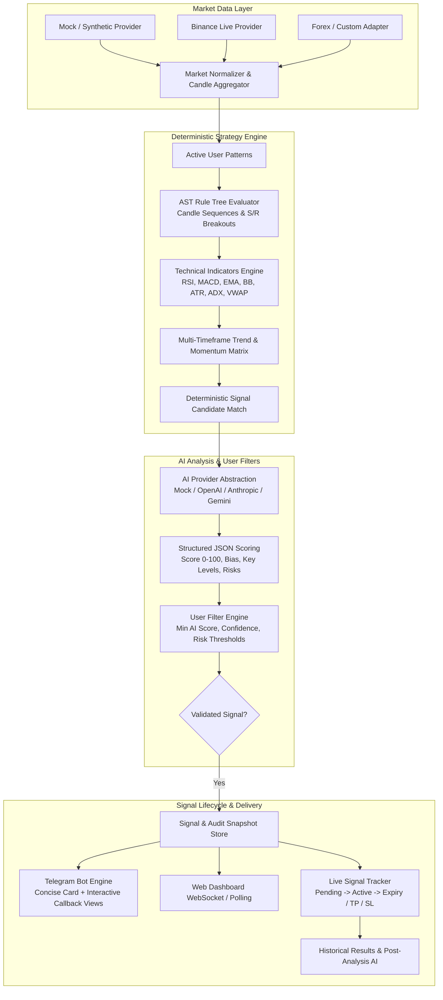

# TradePulse AI - System Architecture

## Overview

TradePulse AI is a personalized, AI-powered quantitative market research and trade-signal notification platform. It operates under a strict **Zero-Trade-Execution** scope: it detects patterns, runs multi-timeframe indicator calculations, enriches setups with AI scoring, and dispatches research notifications to Telegram.

## High-Level Architecture Diagram

## Key Architectural Principles

1. **Deterministic Rule Execution**: LLMs are never used as real-time candle pattern detectors. User strategy rules are executed deterministically via pure Python AST logic.
2. **AI as an Enrichment Layer**: AI acts as a quantitative analyst evaluating market context, bias, key levels, and risk factors.
3. **Pluggable Data Providers**: The system abstracts market data sources (Mock, Binance, etc.) so new asset classes can be added without rewriting strategy rules.
4. **Reproducible Signal Auditing**: Every generated signal permanently stores its triggering candle sequence, indicator values, AI reasoning, and filter evaluations.
